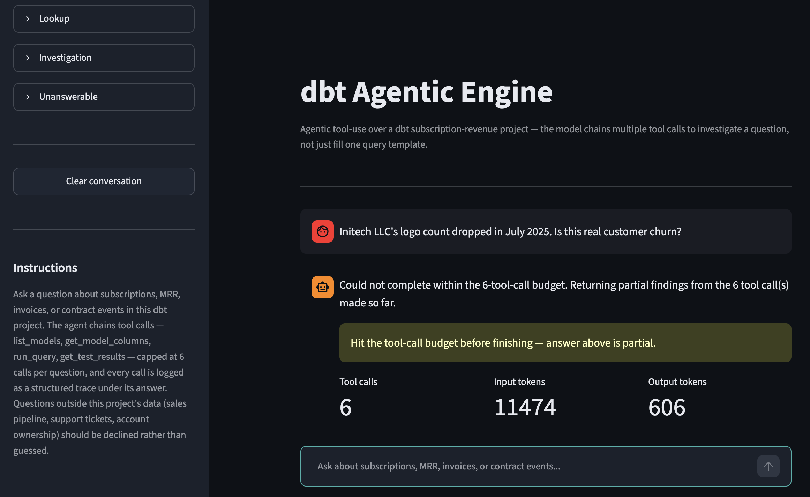
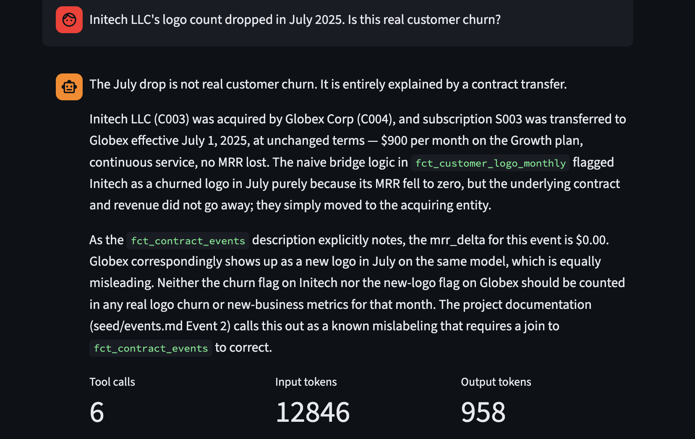
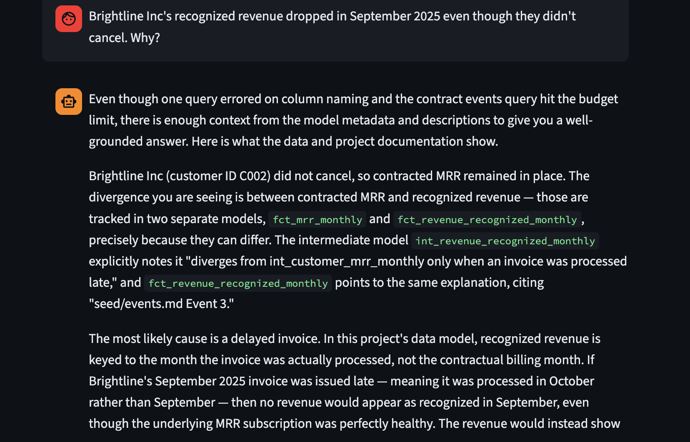
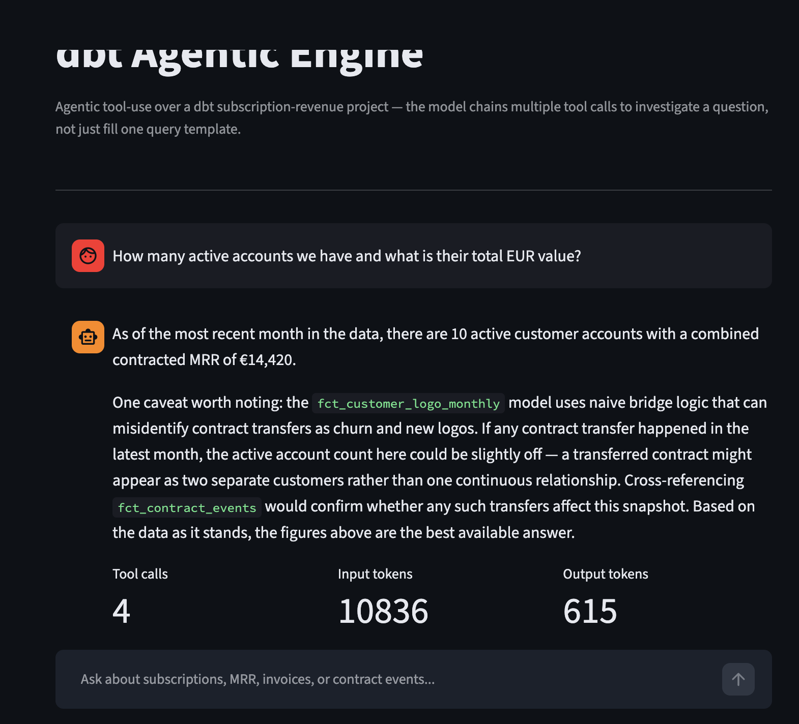

# dbt Agentic Engine

[](https://github.com/PZawieja/dbt-agentic-engine/actions/workflows/ci.yml)

Agentic tool-use over a dbt project: an LLM that chains multiple tool calls — listing
models, checking columns, running read-only SQL, checking test results — to investigate
an analytics question, rather than filling one pre-approved query template. Every tool
call is logged as a structured trace; the trace, not the chat answer, is the
differentiator this project is built to show.

## The gap this closes

An earlier project, `revenue-intelligence-agent`, demonstrates governed AI the other
way: intent classification picks a pre-approved query template and fills it in. That's
the right instinct for safety, but it's one-shot — the model picks a template, it
doesn't reason across steps. This project is the next level: a question like "why did
Initech's logo count drop in July" requires checking the logo mart, the MRR mart, and
the contract-events log, and cross-referencing them, not running one query.

## What's here

- **`dbt/`** — a small subscription-revenue dbt project on DuckDB (staging →
  intermediate → marts), seeded with deliberately messy SaaS data: a plan upgrade, a
  contract transfer from an acquisition, a delayed invoice, a new logo, a cancellation.
  See `dbt/seeds/events.md` for the full event log these questions are built around.
- **`agent/`** — the toolbelt (`tools.py`), the Claude tool-use loop (`agent_loop.py`),
  structured trace logging (`trace_log.py`), and a Streamlit demo (`app.py`).
- **`eval/questions.yml`** — 15 hand-written questions (lookup / investigation /
  unanswerable tiers) used to sanity-check the agent. Project 2 in this series,
  [`llmops-eval-harness`](https://github.com/PZawieja/llmops-eval-harness), reads this
  file directly and runs the full set live with scoring, cost tracking, and regression
  gating.
- **`traces/sample_trace_q07.jsonl`** — one committed example trace: a clean 6-call
  resolution of the Initech/Globex contract-transfer question.
- **`docs/spec.md`** / **`docs/decisions.md`** — the spec this was built against, and an
  append-only log of rejected approaches and known failure modes.

## Toolbelt

| Tool | What it does |
|---|---|
| `list_models()` | dbt model names, layer, one-line description |
| `get_model_columns(model_name)` | columns, types, descriptions for a model |
| `run_query(sql)` | runs a SQL query — **enforced SELECT-only at the connection level** (DuckDB `read_only=True`), not by prompting or regexing the SQL string |
| `get_test_results(model_name)` | dbt test pass/fail status for a model |

The agent gets a hard cap of 6 tool calls per question. If it hits the cap without an
answer, it says so and returns the partial trace — it does not silently truncate or
guess.

## The demo

A local-only Streamlit app (`agent/app.py`): pick an example question from the sidebar,
or type your own, and watch the agent's answer and full execution trace render as a
chat turn.



The two screenshots below are the same class of question — "is this logo drop real
churn" — run on different occasions. One resolves cleanly in 3 calls; the other hits the
6-call cap above. That inconsistency is real and is documented in `docs/decisions.md`,
not papered over: the model sometimes guesses a column name instead of checking it
first, burns a call on a `Binder Error`, and runs out of budget. The trace makes that
visible instead of hiding it behind a confident-sounding wrong answer.



The agent also recovers mid-investigation: here it guesses a column name, gets a
`Binder Error`, and still lands on a well-grounded answer using the remaining budget.



Free-form questions work the same way — no need to stick to the eval set:



## Running it locally

```bash
cd dbt
pip install -r requirements.txt              # dbt-core + dbt-duckdb, pinned
cp profiles.yml.example ~/.dbt/profiles.yml  # one-time, per machine
dbt build                                    # builds the DuckDB warehouse from seeds

cd ../agent && uv sync
echo "ANTHROPIC_API_KEY=sk-..." > .env   # gitignored — never commit this
uv run streamlit run app.py
```

The API key is read from a local `.env` file and never leaves your machine — this app
is not deployed anywhere a third party could spend that key's budget. See
`docs/decisions.md` for why.

## Manual sanity check (Phase 5, against `eval/questions.yml`)

All 15 questions run live against the agent: lookup tier 5/5 correct, unanswerable tier
3/3 correctly declined — both clear the project's done-criteria. Investigation tier 5/7
correct; the 2 failures hit the tool-call cap for the reason described above (known
model stochasticity, not a bug in the loop — see `docs/decisions.md`).

## Series

| # | Repo | What it adds |
|---|---|---|
| 1 | [dbt-agentic-engine](https://github.com/PZawieja/dbt-agentic-engine) (this repo) | Agentic tool-use + structured trace |
| 2 | [llmops-eval-harness](https://github.com/PZawieja/llmops-eval-harness) | Scored eval loop, cost/latency tracking, regression gate |
| 3 | — | Semantic layer agent (MetricFlow) |
| 4 | — | Multi-tenant cost guardrails |

## Non-goals (v1)

No multi-tenant cost controls, no semantic layer / MetricFlow integration, no write
access of any kind from the agent. See `docs/spec.md` for the full scope.
